## Part 1. Инструмент ipcalc

### 1.1. Сети и маски

Определить и записать в отчёт:

- Адрес сети 192.167.38.54/13
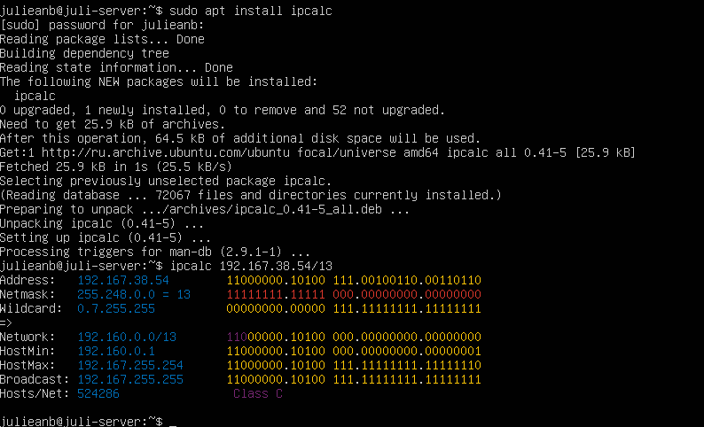

- Перевод маски 255.255.255.0 в префиксную и двоичную запись, /15 в обычную и двоичную, 11111111.11111111.11111111.11110000 в обычную и префиксную
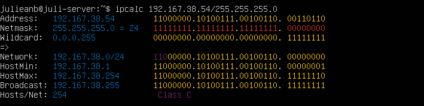

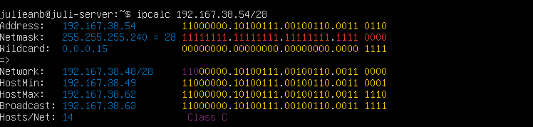

- Минимальный и максимальный хост в сети 12.167.38.4 при масках: /8, 11111111.11111111.00000000.00000000, 255.255.254.0 и /4

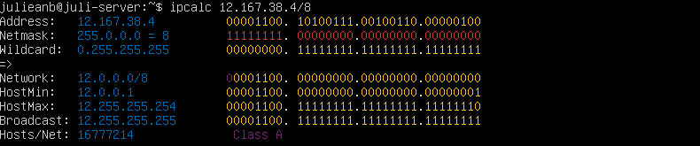
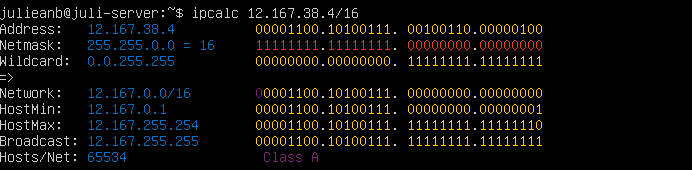
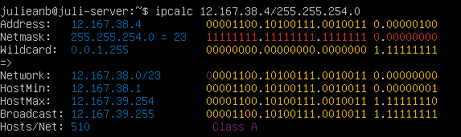
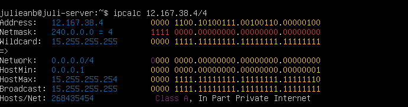

### 1.2. localhost

- Определить и записать в отчёт, можно ли обратиться к приложению, работающему на localhost, со следующими IP: 194.34.23.100, 127.0.0.2, 127.1.0.1, 128.0.0.1
Для localhost зарезервирован диапазон ip 127.0.0.1 - 127.255.255.254. Поэтому обратиться к приложению, работающем на localhost с IP 194.34.23.100 и 128.0.0.1 мы не сможем, тогда как к IP 127.0.0.2 и 127.1.0.1 сможем.

### 1.3. Диапазоны и сегменты сетей

- Kакие из перечисленных IP можно использовать в качестве публичного, а какие только в качестве частных: 10.0.0.45, 134.43.0.2, 192.168.4.2, 172.20.250.4, 172.0.2.1, 192.172.0.1, 172.68.0.2, 172.16.255.255, 10.10.10.10, 192.169.168.1
Диапазоны частных ip-адресов:
10.0.0.0 - 10.255.255.255
172.16.0.0 - 172.31.255.255
192.168.0.0 - 192.168.255.255
Поэтому:
10.0.0.45 - Частный
134.43.0.2 - Публичный
192.168.4.2 - Частный
172.20.250.4 - Частный
172.0.2.1 - Публичный
192.172.0.1 - Публичный
172.68.0.2 - Публичный
172.16.255.255 - Частный
10.10.10.10 - Частный
192.169.168.1 - Публичный

- Kакие из перечисленных IP адресов шлюза возможны у сети 10.10.0.0/18: 10.0.0.1, 10.10.0.2, 10.10.10.10, 10.10.100.1, 10.10.1.255
10.10.0.2
10.10.10.10
10.10.1.255

## Part 2. Статическая маршрутизация между двумя машинами

- С помощью команды ip a посмотреть существующие сетевые интерфейсы
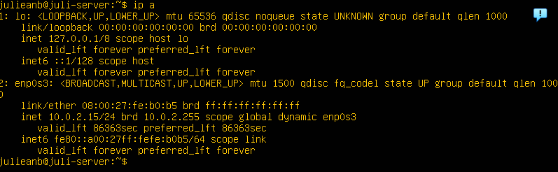
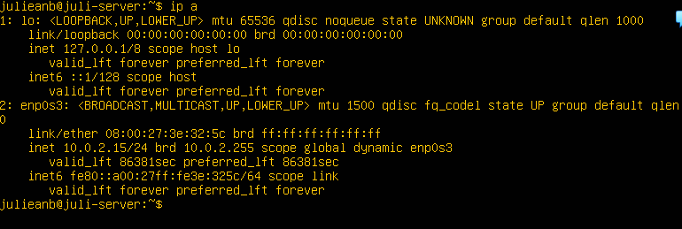

- Описать сетевой интерфейс, соответствующий внутренней сети, на обеих машинах и задать следующие адреса и маски: ws1 - 192.168.100.10, маска /16, ws2 - 172.24.116.8, маска /12
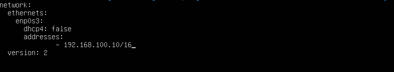
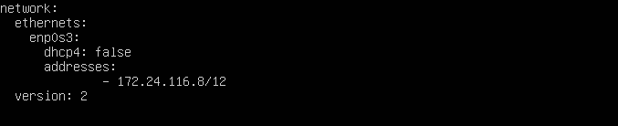

- Выполнить команду netplan apply для перезапуска сервиса сети

### 2.1. Добавление статического маршрута вручную

- Добавить статический маршрут от одной машины до другой и обратно при помощи команды вида ip r add. Пропинговать соединение между машинами
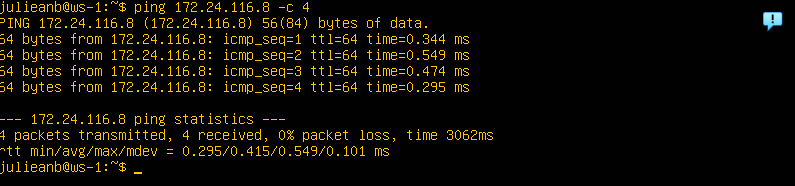
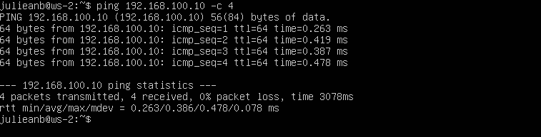

### 2.2. Добавление статического маршрута с сохранением

- Добавить статический маршрут от одной машины до другой с помощью файла etc/netplan/00-installer-config.yaml. Пропинговать соединение между машинами
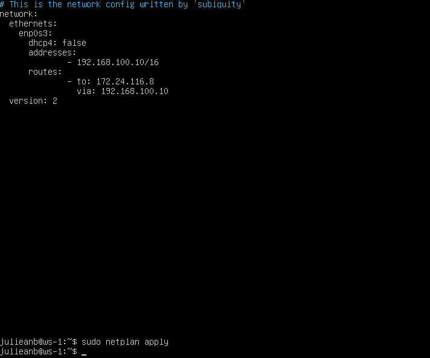
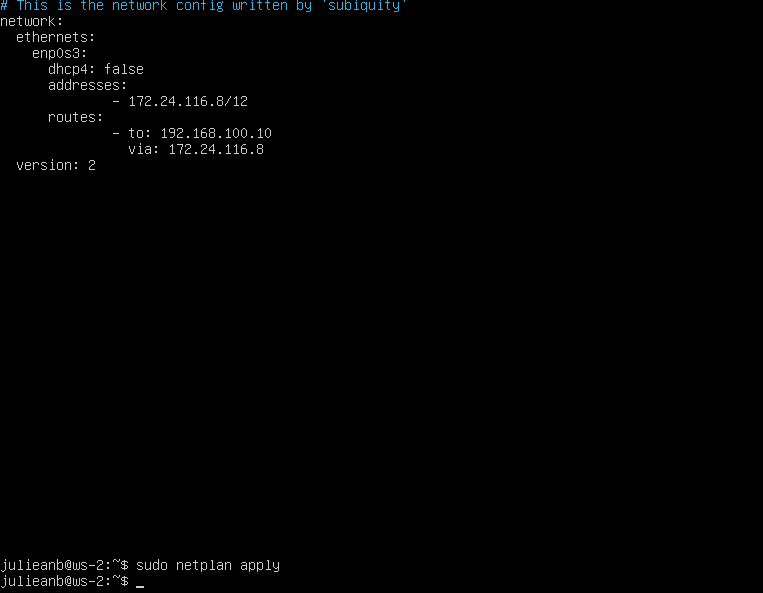
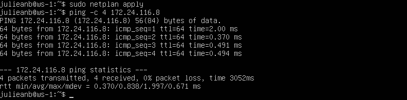
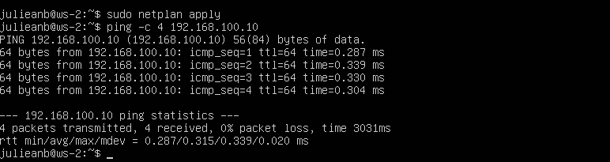

## Part 3. Утилита iperf3

### 3.1. Скорость соединения

- Перевести и записать в отчёт: 8 Mbps в MB/s, 100 MB/s в Kbps, 1 Gbps в Mbps
8 Mpbs = 1 MB/s
100 MB/s = 100000 Kbps
1 Gbps = 1000 Mbps

### 3.2. Утилита iperf3

- Измерить скорость соединения между ws1 и ws2
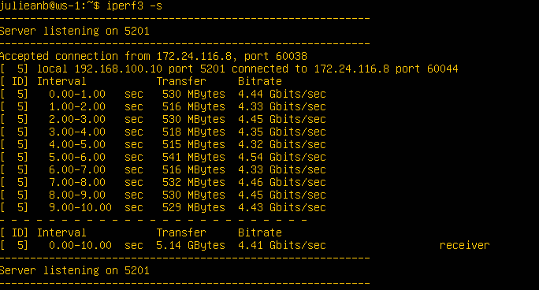
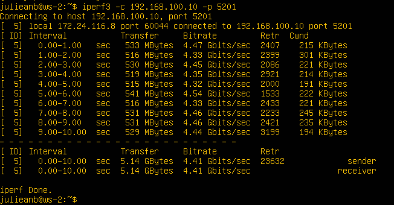