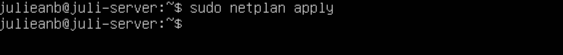
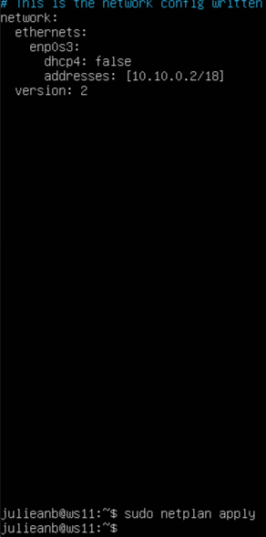
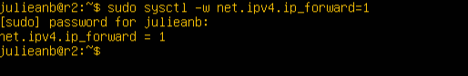
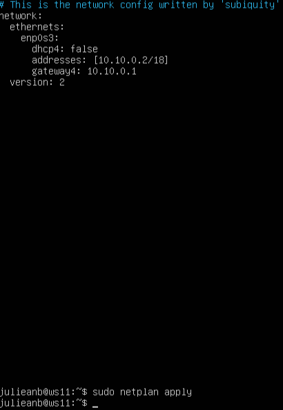
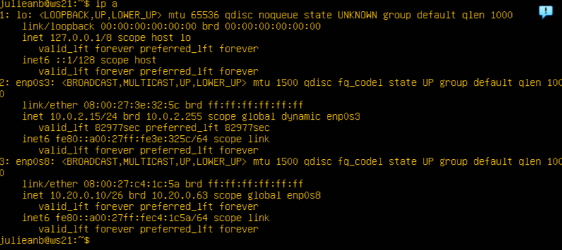

## Part 1. Инструмент ipcalc

### 1.1. Сети и маски

Определить и записать в отчёт:

- Адрес сети 192.167.38.54/13

- Перевод маски 255.255.255.0 в префиксную и двоичную запись, /15 в обычную и двоичную, 11111111.11111111.11111111.11110000 в обычную и префиксную

- Минимальный и максимальный хост в сети 12.167.38.4 при масках: /8, 11111111.11111111.00000000.00000000, 255.255.254.0 и /4

### 1.2. localhost

- Определить и записать в отчёт, можно ли обратиться к приложению, работающему на localhost, со следующими IP: 194.34.23.100, 127.0.0.2, 127.1.0.1, 128.0.0.1
Для localhost зарезервирован диапазон ip 127.0.0.1 - 127.255.255.254. Поэтому обратиться к приложению, работающем на localhost с IP 194.34.23.100 и 128.0.0.1 мы не сможем, тогда как к IP 127.0.0.2 и 127.1.0.1 сможем.

### 1.3. Диапазоны и сегменты сетей

- Kакие из перечисленных IP можно использовать в качестве публичного, а какие только в качестве частных: 10.0.0.45, 134.43.0.2, 192.168.4.2, 172.20.250.4, 172.0.2.1, 192.172.0.1, 172.68.0.2, 172.16.255.255, 10.10.10.10, 192.169.168.1
Диапазоны частных ip-адресов:
10.0.0.0 - 10.255.255.255
172.16.0.0 - 172.31.255.255
192.168.0.0 - 192.168.255.255
Поэтому:
10.0.0.45 - Частный
134.43.0.2 - Публичный
192.168.4.2 - Частный
172.20.250.4 - Частный
172.0.2.1 - Публичный
192.172.0.1 - Публичный
172.68.0.2 - Публичный
172.16.255.255 - Частный
10.10.10.10 - Частный
192.169.168.1 - Публичный

- Kакие из перечисленных IP адресов шлюза возможны у сети 10.10.0.0/18: 10.0.0.1, 10.10.0.2, 10.10.10.10, 10.10.100.1, 10.10.1.255
10.10.0.2
10.10.10.10
10.10.1.255

## Part 2. Статическая маршрутизация между двумя машинами

- С помощью команды ip a посмотреть существующие сетевые интерфейсы

- Описать сетевой интерфейс, соответствующий внутренней сети, на обеих машинах и задать следующие адреса и маски: ws1 - 192.168.100.10, маска /16, ws2 - 172.24.116.8, маска /12

- Выполнить команду netplan apply для перезапуска сервиса сети

### 2.1. Добавление статического маршрута вручную

- Добавить статический маршрут от одной машины до другой и обратно при помощи команды вида ip r add. Пропинговать соединение между машинами

### 2.2. Добавление статического маршрута с сохранением

- Добавить статический маршрут от одной машины до другой с помощью файла etc/netplan/00-installer-config.yaml. Пропинговать соединение между машинами

## Part 3. Утилита iperf3

### 3.1. Скорость соединения

- Перевести и записать в отчёт: 8 Mbps в MB/s, 100 MB/s в Kbps, 1 Gbps в Mbps
8 Mpbs = 1 MB/s
100 MB/s = 100000 Kbps
1 Gbps = 1000 Mbps

### 3.2. Утилита iperf3

- Измерить скорость соединения между ws1 и ws2

## Part 4. Сетевой экран

### 4.1. Утилита iptables

**iptables** — это утилита брандмауэра командной строки, которая использует цепочки политик для разрешения или блокировки трафика. Когда соединение пытается установиться в системе, ` iptables ` ищет правило в своем списке, чтобы сопоставить его. Если утилита не находит нужного правила, она прибегает к действию по умолчанию.

- 1) на ws1 применить стратегию когда в начале пишется запрещающее правило, а в конце пишется разрешающее правило (это касается пунктов 4 и 5)
2) на ws2 применить стратегию когда в начале пишется разрешающее правило, а в конце пишется запрещающее правило (это касается пунктов 4 и 5)
3) открыть на машинах доступ для порта 22 (ssh) и порта 80 (http)
4) запретить echo reply (машина не должна "пинговаться”, т.е. должна быть блокировка на OUTPUT)
5) разрешить echo reply (машина должна "пинговаться")

- Запустить файлы на обеих машинах командами chmod +x /etc/firewall.sh и /etc/firewall.sh

Разница между примененными стратегиями: в утилите ` iptables ` правила выполняются сверху вниз.
На ws1 первым указано запрещающее правило на выход, поэтому она не сможет пропинговать другую машину. 
На ws2, наоброт - первым указано разрешающее правило, значит она сможет пропинговать другую машину.

### 4.2. Утилита nmap

- Командой ping найти машину, которая не "пингуется", после чего утилитой nmap показать, что хост машины запущен

## Part 5. Статическая маршрутизация сети

### 5.1. Настройка адресов машин

- Настроить конфигурации машин в etc/netplan/00-installer-config.yaml согласно сети на рисунке.

- Перезапустить сервис сети. Если ошибок нет, то командой ip -4 a проверить, что адрес машины задан верно. Также пропинговать ws22 с ws21. Аналогично пропинговать r1 с ws11.

### 5.2. Включение переадресации IP-адресов.

- Для включения переадресации IP, выполните команду на роутерах:
sysctl -w net.ipv4.ip_forward=1

- Откройте файл /etc/sysctl.conf и добавьте в него следующую строку:
net.ipv4.ip_forward = 1

### 5.3. Установка маршрута по-умолчанию

- Настроить маршрут по-умолчанию (шлюз) для рабочих станций.

- Вызвать ip r и показать, что добавился маршрут в таблицу маршрутизации

- Пропинговать с ws11 роутер r2 и показать на r2, что пинг доходит

### 5.4. Добавление статических маршрутов

- Добавить в роутеры r1 и r2 статические маршруты в файле конфигураций

- Вызвать ip r и показать таблицы с маршрутами на обоих роутерах. 

- Запустить команды на ws11:
ip r list 10.10.0.0/[маска сети] и ip r list 0.0.0.0/0

Для адреса 10.10.0.0/18 был выбран маршрут, отличный от 0.0.0.0/0 (он попадает под маршрут по-умолчанию), т.к. машина ws11 соединена с сетью 10.10.0.0/18 по своему IP-адресу 10.10.0.2, для других адресов используется маршрут по умолчанию, который указан в файле 10.10.0.1.

### 5.5. Построение списка маршрутизаторов

- При помощи утилиты traceroute построить список маршрутизаторов на пути от ws11 до ws21

tcpdump -tnv -i enp0s8
-n - не конвертировать адреса в имена;
-t - не выводить время при выводе каждой строкчи дампа;
-v - при синтаксическом анализе и выводить более подробную информацию. 

### 5.6. Использование протокола ICMP при маршрутизации

- Запустить на r1 перехват сетевого трафика, проходящего через eth0 с помощью команды:
tcpdump -n -i eth0 icmp

- Пропинговать с ws11 несуществующий IP

## Part 6. Динамическая настройка IP с помощью DHCP

- Для r2 настроить в файле /etc/dhcp/dhcpd.conf конфигурацию службы DHCP:

- B файле resolv.conf прописать nameserver 8.8.8.8.

- Перезагрузить службу DHCP командой systemctl restart isc-dhcp-server. Машину ws21 перезагрузить при помощи reboot и через ip a показать, что она получила адрес. Также пропинговать ws22 с ws21.

- Указать MAC адрес у ws11, для этого в etc/netplan/00-installer-config.yaml надо добавить строки: macaddress: 10:10:10:10:10:BA, dhcp4: true

- Для r1 настроить аналогично r2, но сделать выдачу адресов с жесткой привязкой к MAC-адресу (ws11). Провести аналогичные тесты

- Запросить с ws21 обновление ip адреса

## Part 7. NAT

- В файле /etc/apache2/ports.conf на ws22 и r1 изменить строку Listen 80 на Listen 0.0.0.0:80, то есть сделать сервер Apache2 общедоступным

- Запустить веб-сервер Apache командой service apache2 start на ws22 и r1

- Добавить в фаервол, созданный по аналогии с фаерволом из Части 4, на r2 следующие правила:
1) Удаление правил в таблице filter - iptables -F
2) Удаление правил в таблице "NAT" - iptables -F -t nat
3) Отбрасывать все маршрутизируемые пакеты - iptables --policy FORWARD DROP

- Проверить соединение между ws22 и r1 командой ping. При запуске файла с этими правилами, ws22 не должна "пинговаться" с r1

- Добавить в файл ещё одно правило:
4) Разрешить маршрутизацию всех пакетов протокола ICMP

- Проверить соединение между ws22 и r1 командой ping. При запуске файла с этими правилами, ws22 должна "пинговаться" с r1

- Добавить в файл ещё два правила:
5) Включить SNAT, а именно маскирование всех локальных ip из локальной сети, находящейся за r2 (по обозначениям из Части 5 - сеть 10.20.0.0)
6) Включить DNAT на 8080 порт машины r2 и добавить к веб-серверу Apache, запущенному на ws22, доступ извне сети
стоит учесть, что при попытке подключения возникнет новое tcp-соединение, предназначенное ws22 и 80 порту

- Проверить соединение по TCP для SNAT, для этого с ws22 подключиться к серверу Apache на r1 командой:
telnet [адрес] [порт]
Проверить соединение по TCP для DNAT, для этого с r1 подключиться к серверу Apache на ws22 командой telnet (обращаться по адресу r2 и порту 8080)

## Part 8. Дополнительно. Знакомство с SSH Tunnels

- Запустить веб-сервер Apache на ws22 только на localhost (то есть в файле /etc/apache2/ports.conf изменить строку Listen 80 на Listen localhost:80)

- Запустить на r2 фаервол с правилами из Части 7

- Воспользоваться Local TCP forwarding с ws21 до ws22, чтобы получить доступ к веб-серверу на ws22 с ws21
Воспользоваться Remote TCP forwarding c ws11 до ws22, чтобы получить доступ к веб-серверу на ws22 с ws11
Для проверки, сработало ли подключение в обоих предыдущих пунктах, выполните команду:
telnet 127.0.0.1 [локальный порт]

ssh -L 8080:localhost:80 10.20.0.20
ssh -R 8080:localhost:80 10.20.0.20 