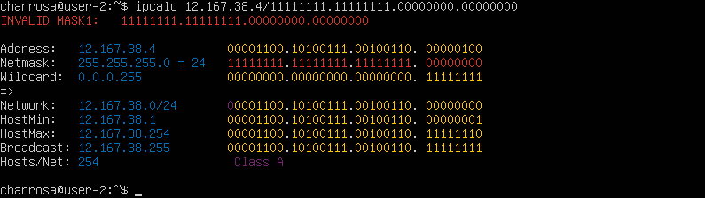
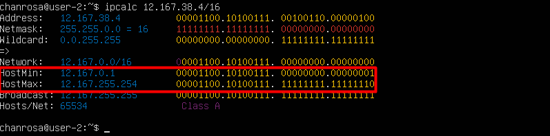
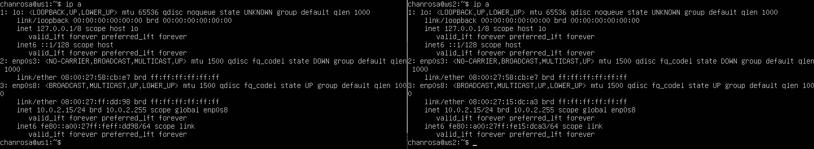

## Part 1. Инструмент ipcalc

**ipcalc** — это утилита, которая может выполнять простые манипуляции с адресами IPv4.

Для установки утилиты ` ipcalc ` следует ввести следующую команду:

> ` sudo apt install ipcalc `

### 1.1. Сети и маски

#### 1.1.1 Определяем адрес сети *192.167.38.54/13* с помощью команды

> ` ipcalc 192.167.38.54/13 `

#### 1.1.2 Перевод маски: 

> ` ipcalc 192.167.38.54/255.255.255.0 `

- префиксная: 24
- двоичная: 11111111.11111111.11111111.00000000

> ` ipcalc 192.167.38.54/15 `

- обычная: 255.254.0.0
- двоичная: 11111111.11111110.00000000.00000000

> ` ipcalc 192.167.38.54/11111111.11111111.11111111.11110000 `

- обычная: 255.255.255.240
- префиксная: 28

#### 1.1.3 Минимальный и максимальный хост:

> ` ipcalc 12.167.38.4/8 `

> ` ipcalc 12.167.38.4/11111111.11111111.00000000.00000000 `

> ` ipcalc 12.167.38.4/255.255.254.0 `

> ` ipcalc 12.167.38.4/4 `

### 1.2. localhost

Определить и записать в отчёт, можно ли обратиться к приложению, работающему на localhost, со следующими IP: 194.34.23.100, 127.0.0.2, 127.1.0.1, 128.0.0.1 .

- можно обратиться: *127.0.0.2, 127.1.0.1*

> ` ipcalc 127.0.0.2 / ipcalc 127.1.0.1 `

- нельзя обратиться: *194.34.23.100, 128.0.0.1*

> ` ipcalc 194.34.23.100 / ipcalc 128.0.0.1 `

### 1.3. Диапазоны и сегменты сетей

#### 1.3.1 Определить и записать в отчёт какие из перечисленных IP можно использовать в качестве публичного, а какие только в качестве частных: 10.0.0.45, 134.43.0.2, 192.168.4.2, 172.20.250.4, 172.0.2.1, 192.172.0.1, 172.68.0.2, 172.16.255.255, 10.10.10.10, 192.169.168.1. 

*Публичный IP адрес - называется IP адрес, который используется для выхода в Интернет. 
Частный IP адрес - адреса, используемые в локальных сетях (не может быть напрямую подключен к Интернету).*

 - Публичные: *134.43.0.2, 172.0.2.1, 192.172.0.1, 172.68.0.2, 192.169.168.1*

- Частные: *10.0.0.45, 192.168.4.2, 172.20.250.4, 172.16.255.255, 10.10.10.10*

#### 1.3.2 Определить и записать в отчёт какие из перечисленных IP адресов шлюза возможны у сети 10.10.0.0/18: 10.0.0.1, 10.10.0.2, 10.10.10.10, 10.10.100.1, 10.10.1.255

- возможны: 10.10.0.2, 10.10.10.10, 10.10.1.255 (попадают в диапазон).

## Part 2. Статическая маршрутизация между двумя машинами

#### 2.0.1 Поднимаем две виртуальные машины  ws1 и ws2.

#### 2.0.2 С помощью команды *ip a* смотрим существующие сетевые интерфейсы

#### 2.0.3 Описать сетевой интерфейс, соответствующий внутренней сети, на обеих машинах и задать следующие адреса и маски: ws1 - 192.168.100.10, маска /16, ws2 - 172.24.116.8, маска /12

- проверяем адреса машин

> ` netstat -nr `
- ` -n ` - отбражение адресов в числовом виде;
- ` -r ` - отображение в виде таблицы.

Используем следующую команду для открытия файла и установки в нём статического адреса.

> ` sudo vim /etc/netplan/00-installer-config.yaml `

#### 2.0.4 Выполним команду *netplan apply* для перезапуска сервиса сети

> ` sudo netplan apply -> netstat -nr -> ip a `

### 2.1. Добавление статического маршрута вручную

#### 2.1.1 Добавим статический маршрут от одной машины до другой и обратно

> ` sudo ip route add 172.24.116.8(192.168.100.0) dev enp0s3 `

#### 2.1.2 Пропингуем соединение между машинами с помощью следующей команды

> ` ping -c(кол-во пакетов что бы ограничить) 6 <IP-address> `

> ` ping -c 6 172.24.116.8 (192.168.100.10)`

### 2.2. Добавление статического маршрута с сохранением

Перезапустим машины, данные не сохранились

> ` ip r `

Добавляем статический маршрут от одной машины до другой, редактируя файл ` etc/netplan/00-installer-config.yaml `.

> ` sudo nano etc/netplan/00-installer-config.yaml `

Применяем новые настройки с помощью команды 
> ` sudo netplan apply `
Пропингуем соединение между машинами

> ` ping -c 6 172.24.116.8 (192.168.100.10)`

## Part 3. Утилита iperf3

### 3.1. Скорость соединения

Перевести и записать в отчёт:

* 8 Mbps (мегабит в секуду) = 1 MB/s (мегабайт в секунду)

* 100 MB/s (мегабайт в секунду) = 800 000 Kbps (килобит в секунду)

* 1 Gbps (гигабит в секунду) = 1 000 Mbps (мегабит в секунду)

### 3.2. Утилита iperf3

#### 3.2.1 Измерим скорость соединения между ws1 и ws2 с помощью утилиты iperf3

Установка утилиты ` iperf3 ` осуществляется с помощью команды

> ` sudo apt install iperf3 `
 

Запускаем утилиту на ` ws1 ` в режиме сервер с флагом ` -s `. Она будет ожидать пока не запустится этаже утилита на ` ws2 ` в режиме клиента. Следом запускаем на ` ws2 ` утилиту в режиме клиент с флагом ` -c ` и указываем IP-адрес ` ws1 `.

> ` iperf3` 

## Part 4. Сетевой экран

### 4.1. Утилита iptables

**iptables** — это утилита брандмауэра командной строки, которая использует цепочки политик для разрешения или блокировки трафика. Когда соединение пытается установиться в системе, ` iptables ` ищет правило в своем списке, чтобы сопоставить его. Если утилита не находит нужного правила, она прибегает к действию по умолчанию.

Переходим в кореневой каталог

> ` cd `
Создаем файл ` /etc/firewall.sh `, имитирующий фаерволл, на ` ws1 ` и ` ws2 ` с помощью команды

> ` sudo touch /etc/firewall.sh `
Добавляем в файл следующие правила согласно задания:

> ` sudo nano /etc/firewall.sh `
1) на ` ws1 ` применить стратегию когда в начале пишется запрещающее правило, а в конце пишется разрешающее правило (это касается пунктов 4 и 5).

2) на ` ws2 ` применить стратегию когда в начале пишется разрешающее правило, а в конце пишется запрещающее правило (это касается пунктов 4 и 5).

3) открыть на машинах доступ для порта 22 (ssh) и порта 80 (http).

4) запретить *echo reply* (машина не должна "пинговаться”, т.е. должна быть блокировка на OUTPUT).

5) разрешить *echo reply* (машина должна "пинговаться").

Запустим файлы на обеих машинах командами

> ` sudo chmod +x /etc/firewall.sh `
> ` sudo bash /etc/firewall.sh `

Разница между примененными стратегиями: в утилите ` iptables ` правила выполняются сверху вниз.
На ws1 первым указано запрещающее правило на выход, поэтому она не сможет пропинговать другую машину. 
На ws2, наоброт - первым указано разрешающее правило, значит она сможет пропинговать другую машину.

### 4.2. Утилита nmap

*nmap* - это очень популярный сканер сети, для исследования сети и аудита безопасности. Он имеет открытый исходный код, который может использоваться как в Windows, так и в Linux.

#### Поиск машины, которая не "пингуется"

> ` ping IP-address `

В файле ` firewall.sh ` для первой машины первым было указано запрещающее правило, поэтому она не пингуется. Для проверки того чтобы показать, что хост машины запущен воспользуемся утилитой ` nmap `. 
Установим утилиту ` nmap ` с помощью следующей команды. Во время установки появится запрос, нужно будет согласиться.

> ` sudo apt install nmap `
Запускаем утилиту ` nmap ` командой (ищем - Host is up)

> ` sudo nmap IP-address `

#### 4.2.2 Сохраняем дампы образов виртуальных машин.

Выбираем *Сделать* и добавляем снимки. 

Задаём снимку имя и описываем его.

Вид после создания снимков

В папке goinfre, где сохранен образ виртуальной машины, появится новая папка *Snapshots*.

## Part 5. Статическая маршрутизация сети

Создадим сеть, по схеме указанной в задании.

#### 5.0.1 Поднимаем пять виртуальных машин (3 рабочие станции (ws11, ws21, ws22) и 2 роутера (r1, r2)).

Создаём пять виртуальных машин. 

### 5.1. Настройка адресов машин

#### 5.1.1 Настроить конфигурации машин в etc/netplan/00-installer-config.yaml согласно сети на рисунке.

С помощью  утилиты ` netplan ` в файле ` etc/netplan/00-installer-config.yaml ` прописываем настройки для машин, согласно схемы сети. Используем следующую команду на всех машинах для редактирования адресов.

> ` sudo nano /etc/netplan/00-installer-config.yaml `

#### 5.1.2 Перезапустить сервис сети и проверить адрес машины

Перезапускаем сервисысети.

> ` sudo netplan apply `
Проверим, что адрес машины задан верно. 

> ` ip -4 a `

Пропингуем ` ws22 ` с ` ws21 ` и ` r1 ` с ` ws11 ` с помощью команды 

> ` ping -c 5 10.20.0.10 `
 

### 5.2. Включение переадресации IP-адресов.

Для включения переадресации IP, выполняем команду на роутерах 

> ` sudo sysctl -w net.ipv4.ip_forward=1 `
Но переадресация не будет работать после перезагрузки системы.

> ` sudo nano /etc/sysctl.conf `
Раскомментируем строку ` net.ipv4.ip_forward = 1 `. Теперь IP-переадресация включена постоянно.

### 5.3. Установка маршрута по-умолчанию

Добавляем ` gateway4: ip роутера `

> ` sudo nano /etc/netplan/00-installer-config.yaml `

> ` sudo netplan apply `
Вызовем ` ip r `, чтобы показать, что  маршрут добавился в таблицу маршрутизации

Пропингуем с ` ws11 ` роутер ` r2 `, пинг не пройдёт, т.к. роутер "не знает" куда вернуть ответ, при этом передача пакетов с машины осуществляется. 

Запускаем на ` r2 ` утилиту ` tcpdump `, она позволяет прослушать порты и вывести на экран информацию с каких IP адресов приходят пакеты (` enp0s8 `).

> ` tcpdump -tn -i enp0s8 `

Запускаем ` ping ` на ` ws11 ` 

> ` ping -c 5 10.100.0.12` и на экране должно ` r2 ` должно появиться 

### 5.4. Добавление статических маршрутов

#### 5.4.1 Добавить в роутеры r1 и r2 статические маршруты в файле конфигураций.

> ` sudo nano /etc/netplan/00-installer-config.yaml `
Для вступления изменений в силу воспользуемся командой ` sudo netplan apply `

С помощью ` ip r ` проверяем настройки на роутерах

- 10.20.0.0/26 через 10.100.0.12 устройство enp0s9
- 10.10.0.0/18 через 10.100.0.11 устройство enp0s8

Запустить команды на ` ws11 `

> ` ip r list 10.10.0.0/18 `
> ` ip r list 0.0.0.0/0 `

Для адреса *10.10.0.0/18* был выбран маршрут, отличный от *0.0.0.0/0* (он попадает под маршрут по-умолчанию), т.к. машина ` ws11 ` соединена с сетью *10.10.0.0/18* по своему IP-адресу *10.10.0.2*, для других адресов используется маршрут по умолчанию, который указан в файле *10.10.0.1*.

### 5.5. Построение списка маршрутизаторов

Для установки утилиты на ` ws11 ` используем команду 

> ` sudo apt install traceroute `
Запустим на ` r1 ` команду дампа 

> ` tcpdump -tnv -i enp0s8 `
- -n - не конвертировать адреса в имена;
- -t - не выводить время при выводе каждой строкчи дампа;
- -v - при синтаксическом анализе и выводить более подробную информацию. 
` traceroute ` построим список маршрутизаторов на пути от ` .
> ` ws11 ` до ` ws21 `. 

>Команда traceroute linux использует UDP пакеты. Она отправляет пакет с TTL=1 и смотрит адрес ответившего узла, дальше TTL=2, TTL=3 и так пока не достигнет цели. Каждый раз отправляется по три пакета и для каждого из них измеряется время прохождения. Пакет отправляется на случайный порт, который, скорее всего, не занят. Когда утилита traceroute получает сообщение от целевого узла о том, что порт недоступен трассировка считается завершенной.

### 5.6. Использование протокола ICMP при маршрутизации

-Запустим на ` r1 ` перехват сетевого трафика, проходящего через ` enp0s8 ` с помощью команды

-Пропингуем с ` ws11 ` несуществующий IP (например, 10.30.0.111) с помощью команды 

> ` sudo tcpdump -n -i enp0s8 icmp ` & ` ping -c 1 10.30.0.111 `

Сохраняем дампы образов виртуальных машин

Остальные сохраняем аналогично!

## Part 6. Динамическая настройка IP с помощью DHCP

### 6.1 Настройка службы DHCP на r2

Если утилита ` isc-dhcp-server ` ещё не установлена, то файла ` /etc/dhcp/dhcpd.conf ` ещё не существует в нужном виде. Соотвтетственно для работы с протоколом **DHCP** сначала надо установить эту утилиту

> ` sudo apt-get install isc-dhcp-server `

Теперь для **r2** можем настроить в файле ` /etc/dhcp/dhcpd.conf ` конфигурацию службы  ` DHCP `

1) указываем адрес маршрутизатора по-умолчанию, DNS-сервер и адрес внутренней сети.

Редактируем файл ` /etc/dhcp/dhcpd.conf ` 

2) в файле ` /etc/resolv.conf `(содержит адреса серверов имен, к которым имеет доступ данная система) прописываем ` nameserver 8.8.8.8 `

> ` sudo nano /etc/resolv.conf `

Перезагрузим службу **DHCP**

> ` systemctl restart isc-dhcp-server `

> ` sudo systemctl status isc-dhcp-server `

Изменим настройки **ws21** и **ws22** в файле конфигурации, чтобы сделать протокол **DHCP** активным. 
> ` sudo nano /etc/netplan/00-installer-config.yaml `
> ` sudo netplan apply `

Перезагружаем виртуальную машину **ws21**

> ` sudo systemctl reboot `
Проверяем присвоенный устройствам адрес
Проверим соединение машины **ws22** с **ws21**

### 6.2 Указать MAC-адреса 

> ` sudo nano /etc/netplan/00-installer-config.yaml `
> ` sudo netplan apply `

Для **r1** настроим аналогично **r2**,c жесткой привязкой к MAC-адресу (**ws11**).

> ` sudo apt-get install isc-dhcp-server `
> ` sudo nano /etc/dhcp/dhcpd.conf `

> ` sudo nano /etc/resolv.conf `

> ` systemctl restart isc-dhcp-server `
> ` sudo systemctl status isc-dhcp-server `

Cмотрим какой адрес назначен машине **ws11**
Пропингуем соединение

> ` ip a `
> ` ping -c 5 10.10.0.4 `

### 6.3 Обновление ip адреса с помощью команды *sudo dhclient*.

Проверяем IP до обновления

Запросим с **ws21** обновление ip адреса с помощью команды

> ` sudo dhclient -v `
- ` -v ` - будет выведена дополнительная информация.

> ` ip a `

Выполним команду для удаления старого IP адреса

> ` sudo dhclient -r `
- ` -r ` - освобождает ip адреса.

> В части 6 были использованы следующие опции `DHCP` протокола:
  
  > option routers `ip-address [, ip-address...];` - адреса шлюзов для клиентской сети. Маршрутизаторы должны быть перечислены в порядке предпочтительности.
  
  > option domain-name-servers `ip-address [, ip-address...];` - Список DNS серверов  доступных клиенту. Сервера должны быть перечислены в порядке предпочтительности.

Сохраняем дампы образов виртуальных машин.

> `Остальные вм сделаны аналогично`

## Part 7. NAT

Для работы с сервером ` apache2 `, установим его на машины ` r1 `, ` r2 ` и ` ws22 `.
### 7.1 Делаем сервер Apache2 общедоступным.

В файле ` /etc/apache2/ports.conf ` на ` ws22 ` и ` r1 ` меняем строку ` Listen 80 ` на ` Listen 0.0.0.0:80 `.

> ` sudo nano /etc/apache2/ports.conf `

Запустить веб-сервер **Apache** командой на ` ws22 ` и ` r1 `

> ` service apache2 start ` 

### 7.2 Создаем фаервол на r2 [(как в части 4)](#41-утилита-iptables). Следующие правила:

1) Удаление правил в таблице filter - ` iptables -F `
2) Удаление правил в таблице "NAT" - ` iptables -F -t nat `
3) Отбрасывать все маршрутизируемые пакеты - ` iptables --policy FORWARD DROP `

Запустим файлы на обеих машинах командами

> ` sudo chmod +x /etc/firewall.sh `
> ` sudo bash /etc/firewall.sh `

 При запуске файла ` firewall.sh ` с этими правилами, ` ws22 ` не должна "пинговаться" с ` r1 `.

Проверяем соединение между ` r1 ` и ` ws22 `,  `ws22 ` и ` r1 `

> ` ping -c 5 10.20.0.20 `
> ` ping -c 5 10.100.0.11 `

4) Разрешить маршрутизацию всех пакетов протокола ICMP, для этого прописываем правило для протокола *icmp* и цепочки *FORWARD*

> ` sudo nano /etc/apache2/ports.conf `

Теперь при запуске файла ` firewall.sh ` с этими правилами, ` ws22 ` должна "пинговаться" с ` r1 `

Проверяем соединение между ` r1 ` и ` ws22 ` && ` ws22 ` и ` r1 `

Добавляем в файл ещё два правила:

5) Включаем **SNAT**, а именно маскирование всех локальных ip из локальной сети, находящейся за ` r2 ` (по обозначениям из Части 5 - сеть 10.20.0.0)

6) Включаем **DNAT** на 8080 порт машины ` r2 ` и добавим к веб-серверу Apache, запущенному на ` ws22 `, доступ извне сети

> ` sudo nano /etc/apache2/ports.conf `

> Значения использованных опций:
> - ` t ` - указывает на используемую таблицу;
> - ` p ` - указывает протокол, такие как tcp, udp, udplite и другие, поддерживаемые системой, ознакомиться со списком можно в файле ` /etc/protocols `;
> - ` m ` - подключает указанный модуль;
> - ` s ` - указывает адрес источника пакета, в качестве значения можно указать как один IP-адрес, так и диапазон;
> - ` i ` - задает входящий сетевой интерфейс;
> - ` o ` - указывает исходящий сетевой интерфейс;
> - ` --dport ` - порт получателя пакета;
> - ` DNAT ` — подменяет адрес получателя в заголовке IP-пакета, основное применение — предоставление доступа к сервисам снаружи, находящимся внутри сети;
> - ` SNAT ` — служит для преобразования сетевых адресов, применимо, когда за сервером находятся машины, которым необходимо предоставить доступ в Интернет, при этом от провайдера имеется статический IP-адрес.
#### SNAT и DNAT 

Проверяем соединение по TCP для SNAT, для этого с ` ws22 ` подключаемся к серверу Apache на ` r1 ` командой ` telnet [адрес] [порт] `

> ` telnet 10.100.0.11 80 `

Проверить подмену IP-адреса можно с помощью команды ` tcpdump ` - пингуем с машины ` ws22 ` роутер ` r1 `, в выводе ` tcpdump ` будет отображаться с какого адреса идет запрос - IP-адрес ` r2 ` 

Проверяем соединение по TCP для DNAT, для этого с ` r1 ` подключаемся к серверу Apache на ` ws22 ` (обращаться по адресу ` r2 ` и порту 8080)

> ` telnet 10.100.0.20 8080 `

Сохраняем дампы образов виртуальных машин

## Part 8. Дополнительно. Знакомство с SSH Tunnels

Запускаем веб-сервер ` Apache ` на ` ws22 ` только на ` localhost ` (то есть в файле ` /etc/apache2/ports.conf ` изменить строку ` Listen 80 ` на ` Listen localhost:80 `)

> ` sudo nano /etc/apache2/ports.conf `

**1)** Воспользуемся ` Local TCP forwarding ` с ` ws21 ` до ` ws22 `, чтобы получить доступ к веб-серверу на ` ws22 ` с ` ws21 `

> ` ps aux | grep sshd `
Здесь все процессы ` sshd ` которые запущены до момента создания ssh-туннеля на машине ` ws22 ` 

Оставаясь на машине ` ws22 `, устанавливаем соединение с сервером ` ws22 ` от машины ` ws21 `

> ` ssh -L 8080:127.0.0.1:80 10.20.0.20 `

На машине ` ws21 ` запускаем утилиту ` telnet `

> ` telnet 127.0.0.1 8080 `

**2)** Воспользоваться ` Remote TCP forwarding ` c ` ws11 ` до ` ws22 `, чтобы получить доступ к веб-серверу на ` ws22 ` с ` ws11 `.

> ` ssh -R 10.10.0.2:8080:127.0.0.1:80 10.10.0.2 `

> ` telnet 127.0.0.1 8080 `

Сохраняем дампы образов виртуальных машин

